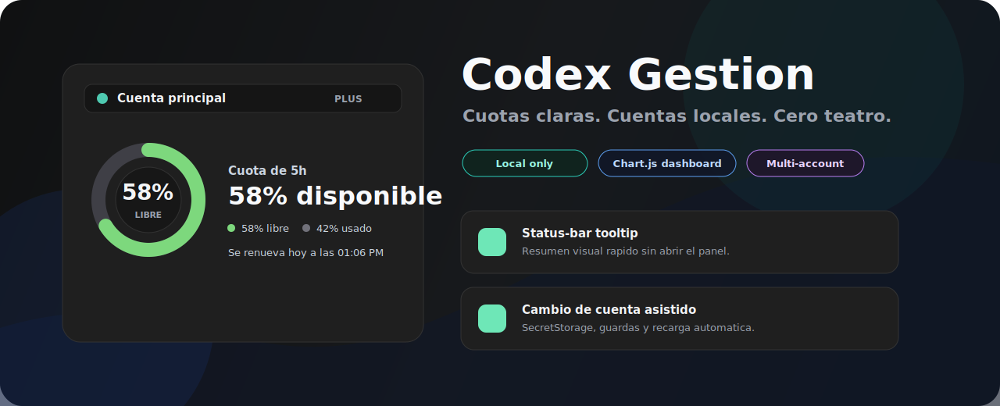
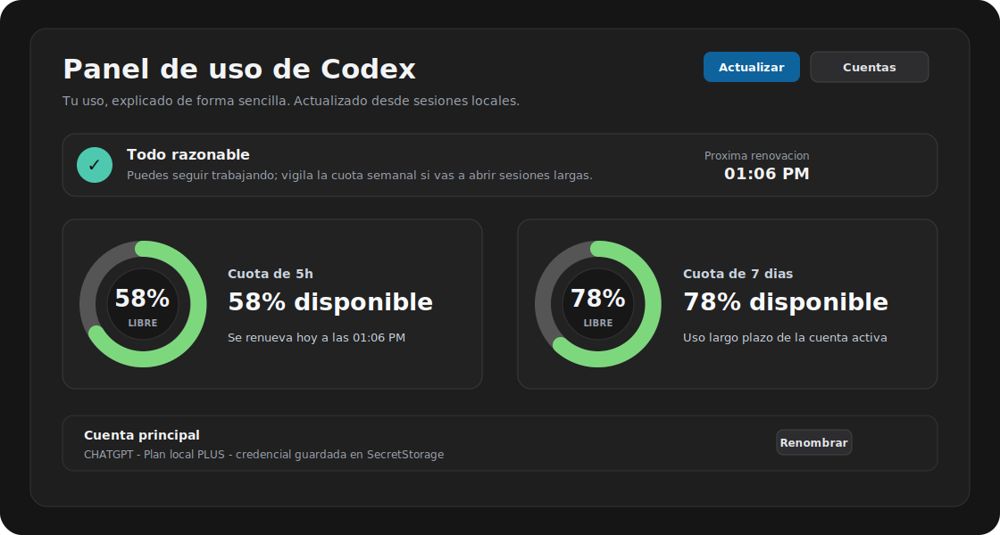
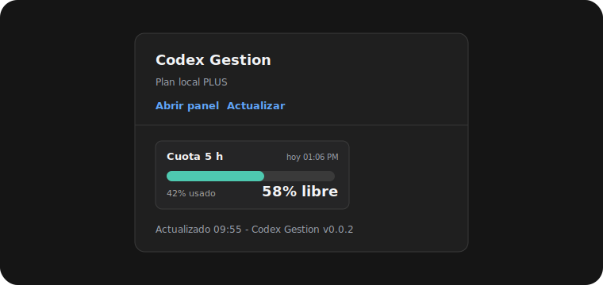

<p align="center">
  
</p>

<h1 align="center">Codex Gestion</h1>

<p align="center">
  A local VS Code dashboard for Codex quotas, sessions, and account switching.
</p>

<p align="center">
  
  
  
  
</p>

<p align="center">
  
</p>

Codex Gestion gives Codex power users a clean local view of usage, quota windows,
account snapshots, and account switching inside VS Code. It is built for the
small but very real moment where you want to know: which account am I using,
how much quota is left, and when does it reset?

## Preview

| Dashboard | Status tooltip |
| --- | --- |
|  |  |

## Highlights

| Area | What it does |
| --- | --- |
| Quotas | Shows primary and secondary Codex quota windows when Codex records them locally. |
| Dashboard | Opens a polished Chart.js dashboard with availability gauges and reset times. |
| Status bar | Adds a compact status-bar summary and visual tooltip for quick checks. |
| Accounts | Stores local account credentials in VS Code SecretStorage and lets you switch accounts. |
| Switching | Reloads VS Code automatically after a successful switch and guards against Codex restoring the previous account. |
| Handoff | Maintains a safe project context file at `.codex-gestion/PROJECT_CONTEXT.md`. |
| Diagnostics | Generates sanitized troubleshooting output without tokens or full chat contents. |

## Privacy-first by design

Codex Gestion is a local helper. It is not a hosted service and it does not need
a backend.

It reads:

- `~/.codex/sessions/**/*.jsonl`
- `~/.codex/auth.json`
- VS Code SecretStorage entries created by this extension
- the current workspace path when creating project context

It writes:

- `~/.codex/auth.json` when you explicitly add or switch accounts
- VS Code SecretStorage entries for saved account credentials
- `.codex-gestion/PROJECT_CONTEXT.md` in the current workspace

It does not intentionally send tokens, credentials, prompts, file contents,
session contents, or diagnostics to any remote server. See `PRIVACY.md` for
the full policy.

## Installation

From a local VSIX package:

```powershell
code --install-extension .\dist\codex-gestion-0.0.2.vsix --force
```

From VS Code, you can also run:

```text
Extensions: Install from VSIX...
```

When published to the Marketplace, search for:

```text
Codex Gestion
```

## Commands

| Command | Purpose |
| --- | --- |
| `Codex Gestion: Abrir panel visual` | Open the visual dashboard. |
| `Codex Gestion: Actualizar` | Refresh local usage data. |
| `Codex Gestion: Gestionar cuentas` | Add, switch, rename, or remove local accounts. |
| `Codex Gestion: Cambiar cuenta` | Switch directly between saved accounts. |
| `Codex Gestion: Abrir contexto del proyecto` | Create or open the handoff context file. |
| `Codex Gestion: Ver diagnostico` | Show sanitized diagnostic output. |

## Multiple accounts

Codex threads cannot combine context windows or rate limits from multiple
accounts. When you switch accounts, Codex Gestion updates the local auth file,
waits briefly to protect the selection, and reloads VS Code so new Codex work
starts from the selected account cleanly.

## Development

```powershell
npm install
npm test
npm run package
```

The package is created at:

```text
dist\codex-gestion-0.0.2.vsix
```

## Publishing

See `PUBLISHING.md`. Before publishing publicly, choose your Marketplace
publisher ID and replace the `publisher` field in `package.json`.

## Support the project

Codex Gestion is free. If it saves you time, donations are welcome but optional:
see `DONATE.md`.

Suggested donation platforms:

- GitHub Sponsors
- Ko-fi
- Buy Me a Coffee
- PayPal.Me
- Stripe Payment Link

## License

MIT. See `LICENSE`.
