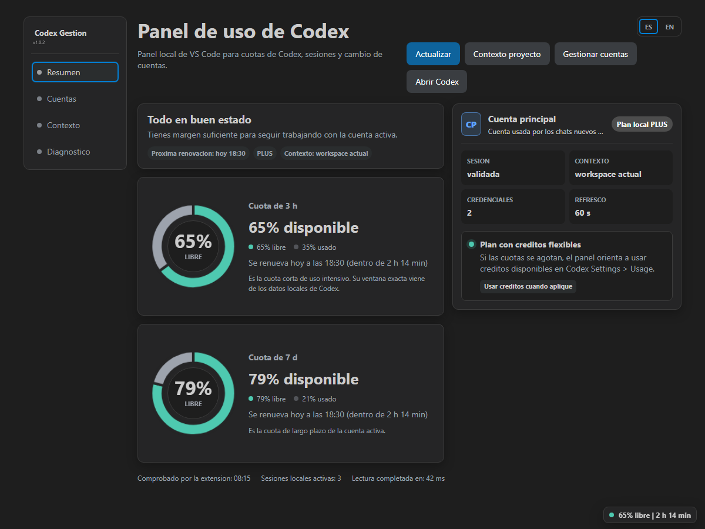
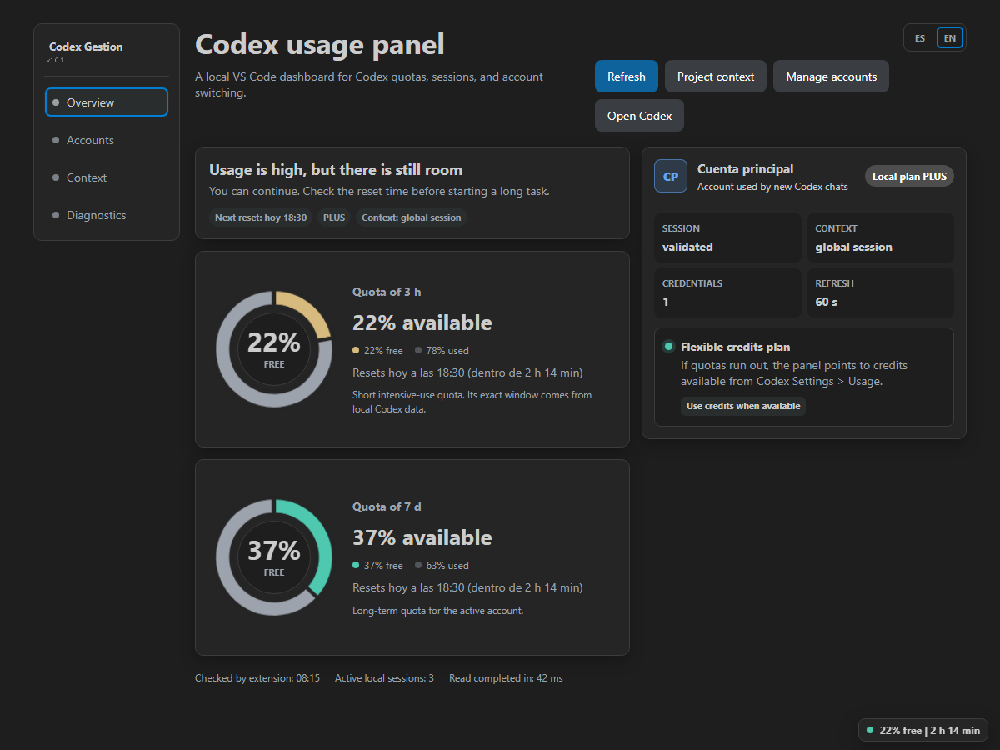
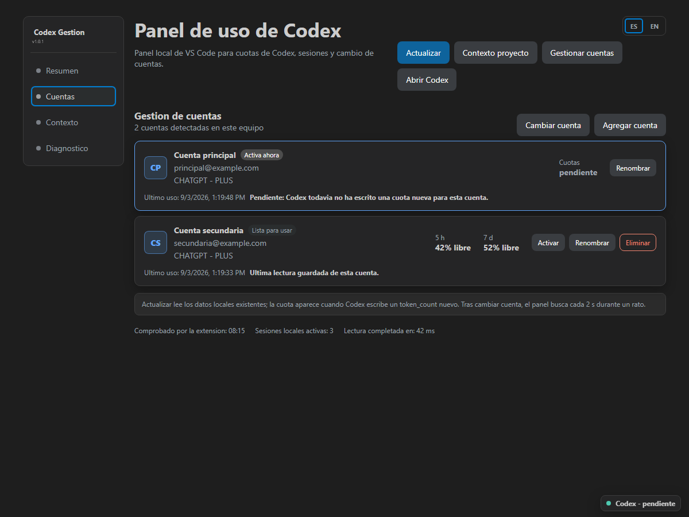
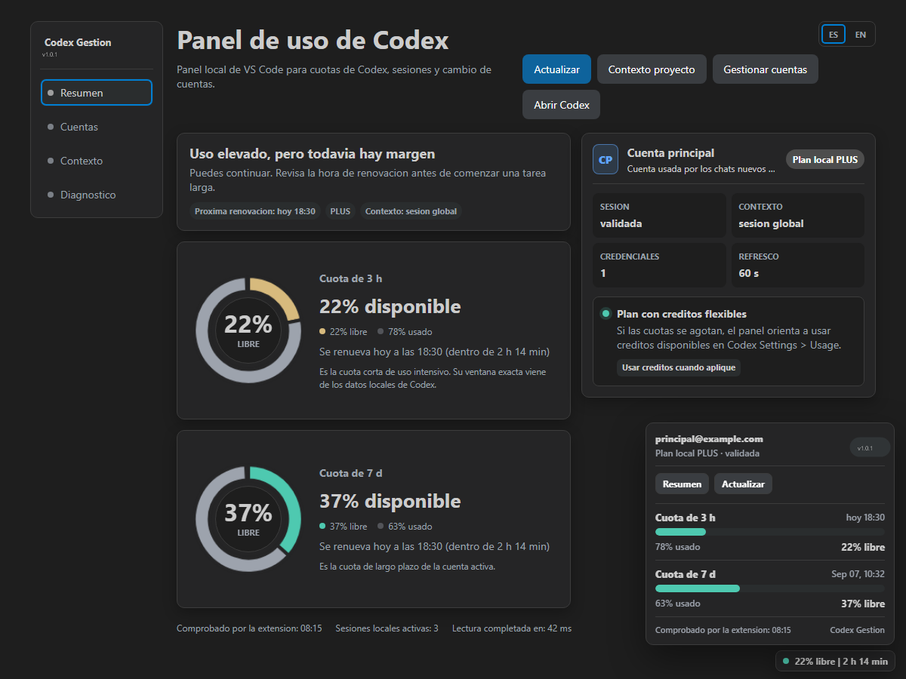

<p align="center">
  
</p>

<h1 align="center">Codex Gestion</h1>

<p align="center">
  A local VS Code dashboard for Codex quotas, sessions, and account switching.
</p>

<p align="center">
  <a href="#english"></a>
  <a href="#espanol"></a>
</p>

<p align="center">
  
  
  
  
</p>

<p align="center">
  
</p>

<a id="english"></a>

## English

<p align="right"><a href="#espanol">Leer en español</a></p>

Codex Gestion gives Codex power users a clear local view of the things
that matter while working in VS Code: active account, local quota windows,
reset timing, plan-aware guidance, and account switching.

<p align="center">
  
</p>

### Quotas without fixed assumptions

Codex plans and quota windows can change. Codex Gestion does not hard-code a
fixed short or long duration. It reads the local Codex usage
data available on this machine, then labels the visible windows by the data Codex
records for the active account.

That means the Marketplace page can stay accurate across Free, Plus, Pro,
Business, Enterprise, Edu, and future plan changes: the extension shows local
availability, reset timing, and account context when Codex has written that data.

### Why this exists

Codex can be used from different accounts, surfaces, and plan tiers, and the
useful quota state is easy to lose sight of while you are deep in a coding
session. Codex Gestion keeps the practical signals close to your editor: local
quota windows, reset times, the active account, and a small handoff file for
continuing work cleanly.

### Local-only privacy

> Codex Gestion has no backend. It reads local Codex session/auth files and VS Code
> SecretStorage, then renders the dashboard inside VS Code. Tokens, prompts,
> diagnostics, and session contents are not intentionally sent to any remote server.

### Marketplace screenshots

The screenshots are generated from the same product surface the extension uses: local quota windows, account cards, status tooltip, and local project handoff. No hidden Codex commands or private chat UI are shown.

**English dashboard**

<p align="center">
  
</p>

**Spanish accounts and saved quota state**

<p align="center">
  
</p>

**Status bar tooltip**

<p align="center">
  
</p>

### Highlights

| Area | What it does |
| --- | --- |
| Quotas | Shows the Codex quota windows recorded locally for the active plan, without assuming fixed durations. |
| Dashboard | Opens a focused Chart.js dashboard with availability gauges and reset times. |
| Health checks | Summarizes local session, quota, context, credentials, and refresh status before long work. |
| Status bar | Adds a compact status-bar summary and visual tooltip for quick checks. |
| Accounts | Stores local account credentials in VS Code SecretStorage and lets you switch accounts. |
| Switching | Reloads VS Code automatically after a successful switch and guards against Codex restoring the previous account. |
| Handoff | Maintains a local project context file at `.codex-gestion/PROJECT_CONTEXT.md`, with optional sanitized session excerpts for account/chat handoff. |
| Diagnostics | Generates sanitized troubleshooting output without tokens or full chat contents. |

### Fixed in 1.0.2

- Quota percentages now preserve a real `1% free` reading instead of forcing it to zero.
- Fractional near-empty readings can still round down to `0% free` when the remaining percentage is below display precision.

### Fixed in 1.0.1

- Status-bar tooltip actions are clickable again: Overview opens the panel and Refresh reads local usage immediately.
- The tooltip keeps the new vertical visual layout without letting VS Code reflow quota cards into columns.

### New in 1.0.0

- Redesigned dashboard with focused Overview, Accounts, Context, and Diagnostics sections.
- Account-aware quota snapshots keep the active account live, preserve saved readings for inactive accounts, and show pending only when Codex has not written a quota for that account yet.
- Dynamic quota windows follow the local data Codex records instead of assuming fixed durations.
- Faster post-switch polling picks up new quota readings shortly after Codex writes them.
- Status-bar hover now uses compact visual quota cards with direct panel and refresh actions.
- Sanitized diagnostics include local health signals without exposing tokens, account IDs, file paths, or chat contents.
- Marketplace screenshots and copy have been refreshed for the 1.0.0 release.

### Since the public 0.0.6 release

1.0.0 is the next public milestone after 0.0.6. It consolidates the dashboard redesign, multi-account quota reliability, smoother quota refresh, status-bar hover redesign, diagnostics improvements, and updated Marketplace assets into one stable release.

### Privacy-first by design

Codex Gestion is a local helper. It is not a hosted service and it does not need
a backend.

It reads:

- `~/.codex/sessions/**/*.jsonl`
- `~/.codex/auth.json`
- VS Code SecretStorage entries created by this extension
- the current workspace path and selected workspace metadata when creating project context
- local Git status, recent commits, `package.json`, and `ROADMAP.md` when creating project context
- recent local Codex session excerpts when project context excerpts are enabled

It writes:

- `~/.codex/auth.json` when you explicitly add or switch accounts
- VS Code SecretStorage entries for saved account credentials
- `.codex-gestion/PROJECT_CONTEXT.md` in the current workspace, optionally including sanitized local session excerpts

It does not intentionally send tokens, credentials, prompts, file contents,
session contents, or diagnostics to any remote server. Session excerpts, when enabled, are written only to the local project context file. See `PRIVACY.md` for
the full policy.

### Installation

From the Marketplace, search for:

```text
Codex Gestion
```

From a local VSIX package:

```powershell
code --install-extension .\dist\codex-gestion-1.0.2.vsix --force
```

### Commands

| Command | Purpose |
| --- | --- |
| `Codex Gestion: Open visual panel` | Open the visual dashboard. |
| `Codex Gestion: Refresh` | Refresh local usage data. |
| `Codex Gestion: Manage accounts` | Add, switch, rename, or remove local accounts. |
| `Codex Gestion: Switch account` | Switch directly between saved accounts. |
| `Codex Gestion: Open project context` | Create or open the handoff context file. |
| `Codex Gestion: View diagnostics` | Show sanitized diagnostic output. |

### Language

Codex Gestion supports English and Spanish. Use `codexGestion.language` to choose:

```text
auto | es | en
```

`auto` follows the VS Code display language.

### Multiple accounts

Codex threads cannot combine context windows or rate limits from multiple
accounts. When you switch accounts, Codex Gestion updates the local auth file,
waits briefly to protect the selection, and reloads VS Code so new Codex work
starts from the selected account cleanly.

### Support the project

Codex Gestion is free. If it saves you time, donations are welcome but optional.

<p align="center">
  <a href="https://ko-fi.com/jacom15"></a>
</p>

Donations do not unlock extra features; they just help keep maintenance moving.
See `DONATE.md` for details.

### License

Codex Gestion is source-available. You may install and use the official extension,
and view the source for transparency, but copying, modifying, redistributing,
repackaging, or publishing derivative extensions is not permitted without written
permission. See `LICENSE`.

---

<a id="espanol"></a>

## Español

<p align="right"><a href="#english">Read in English</a></p>

Codex Gestion ofrece una vista local y clara de lo importante mientras
trabajas con Codex en VS Code: cuenta activa, ventanas de cuota locales,
hora de renovacion, avisos segun plan y cambio de cuenta.

<p align="center">
  
</p>

### Cuotas sin asumir ventanas fijas

Los planes y ventanas de cuota de Codex pueden cambiar. Codex Gestion no fija en
el codigo una ventana concreta como cinco horas o siete dias. Lee los datos
locales de uso que Codex haya escrito en esta maquina y etiqueta las ventanas
visibles segun lo que exista para la cuenta activa.

Asi la pagina de Marketplace sigue siendo honesta para Free, Plus, Pro,
Business, Enterprise, Edu y futuros cambios de plan: la extension muestra
disponibilidad local, hora de renovacion y contexto de cuenta cuando Codex ha
guardado esos datos.

### Por que existe

Codex puede usarse desde varias cuentas, superficies y tipos de plan, y es facil
perder de vista el estado util de cuota cuando estas metido en una sesion de
codigo. Codex Gestion acerca esas senales practicas al editor: ventanas de cuota
locales, horas de renovacion, cuenta activa y un pequeno archivo de traspaso para
continuar el trabajo limpiamente.

### Privacidad local visible

> Codex Gestion no tiene backend. Lee archivos locales de sesion/auth de Codex y
> VS Code SecretStorage, y renderiza el panel dentro de VS Code. No envia
> intencionadamente tokens, prompts, diagnosticos ni contenido de sesiones a
> ningun servidor remoto.

### Capturas para Marketplace

**Panel en ingles**

<p align="center">
  
</p>

**Cuentas en espanol y ultima cuota guardada**

<p align="center">
  
</p>

**Tooltip de barra de estado**

<p align="center">
  
</p>

### Caracteristicas

| Area | Que hace |
| --- | --- |
| Cuotas | Muestra las ventanas de cuota registradas localmente para el plan activo, sin asumir duraciones fijas. |
| Panel visual | Abre un dashboard Chart.js enfocado con graficas de disponibilidad y horas de renovacion. |
| Salud operativa | Resume sesion local, cuotas, contexto, credenciales y refresco antes de trabajos largos. |
| Barra de estado | Anade un resumen compacto y un tooltip visual para consultas rapidas. |
| Cuentas | Guarda credenciales locales en VS Code SecretStorage y permite cambiar entre cuentas. |
| Cambio de cuenta | Recarga VS Code automaticamente tras un cambio correcto y evita que Codex restaure la cuenta anterior. |
| Traspaso | Mantiene un archivo local de contexto en `.codex-gestion/PROJECT_CONTEXT.md`, con extractos saneados opcionales para cambiar de cuenta o chat. |
| Diagnostico | Genera informacion de ayuda saneada, sin tokens ni contenido completo de chats. |

### Corregido en 1.0.2

- Los porcentajes de cuota conservan una lectura real de `1% libre` en vez de forzarla a cero.
- Las lecturas fraccionarias casi vacias pueden redondear a `0% libre` cuando el porcentaje restante queda por debajo de la precision visible.

### Corregido en 1.0.1

- Las acciones del tooltip de la barra de estado vuelven a ser clicables: Resumen abre el panel y Actualizar lee el uso local al momento.
- El tooltip mantiene el nuevo diseno visual vertical sin que VS Code reorganice las cuotas en columnas.

### Nuevo en 1.0.0

- Panel redisenado con secciones enfocadas de Resumen, Cuentas, Contexto y Diagnostico.
- Snapshots de cuota por cuenta: la cuenta activa muestra lectura en vivo, las inactivas conservan su ultima lectura guardada y solo aparece pendiente cuando Codex aun no ha escrito cuota para esa cuenta.
- Ventanas de cuota dinamicas basadas en los datos locales que escribe Codex, sin asumir duraciones fijas.
- Refresco rapido tras cambiar de cuenta para recoger antes las nuevas cuotas cuando Codex las escriba.
- Tooltip de barra de estado con tarjetas visuales compactas y acciones directas para abrir el panel o actualizar.
- Diagnostico saneado con senales de salud local, sin exponer tokens, IDs de cuenta, rutas ni contenido de chats.
- Capturas y textos de Marketplace actualizados para la version 1.0.0.

### Desde la version publica 0.0.6

1.0.0 es el siguiente hito publico despues de 0.0.6. Reune el rediseno del panel, la fiabilidad multi-cuenta de cuotas, el refresco mas suave, el nuevo tooltip de barra de estado, las mejoras de diagnostico y los assets de Marketplace actualizados en una version estable.

### Privacidad primero

Codex Gestion es una ayuda local. No es un servicio alojado y no necesita backend.

Lee:

- `~/.codex/sessions/**/*.jsonl`
- `~/.codex/auth.json`
- entradas de VS Code SecretStorage creadas por esta extension
- la ruta del workspace actual y metadatos seleccionados del workspace al crear contexto de proyecto
- estado Git local, commits recientes, `package.json` y `ROADMAP.md` al crear contexto de proyecto
- extractos recientes de sesiones locales de Codex si los extractos de contexto estan activados

Escribe:

- `~/.codex/auth.json` cuando agregas o cambias cuentas explicitamente
- entradas de VS Code SecretStorage para credenciales guardadas
- `.codex-gestion/PROJECT_CONTEXT.md` en el workspace actual, opcionalmente con extractos saneados de sesiones locales

No envia intencionadamente tokens, credenciales, prompts, contenidos de archivos,
contenidos de sesiones ni diagnosticos a ningun servidor remoto. Los extractos de sesion, si estan activados, solo se escriben en el archivo local de contexto del proyecto. Consulta
`PRIVACY.md` para ver la politica completa.

### Instalacion

Desde el Marketplace, busca:

```text
Codex Gestion
```

Desde un paquete VSIX local:

```powershell
code --install-extension .\dist\codex-gestion-1.0.2.vsix --force
```

### Comandos

| Comando | Uso |
| --- | --- |
| `Codex Gestion: Abrir panel visual` | Abrir el panel visual. |
| `Codex Gestion: Actualizar` | Actualizar los datos locales de uso. |
| `Codex Gestion: Gestionar cuentas` | Agregar, cambiar, renombrar o eliminar cuentas locales. |
| `Codex Gestion: Cambiar cuenta` | Cambiar directamente entre cuentas guardadas. |
| `Codex Gestion: Abrir contexto del proyecto` | Crear o abrir el archivo de contexto de traspaso. |
| `Codex Gestion: Ver diagnostico` | Mostrar diagnostico saneado. |

### Idioma

Codex Gestion soporta ingles y espanol. Usa `codexGestion.language` para elegir:

```text
auto | es | en
```

`auto` sigue el idioma configurado en VS Code.

### Multiples cuentas

Los hilos de Codex no pueden combinar ventanas de contexto ni limites de varias
cuentas. Al cambiar de cuenta, Codex Gestion actualiza el archivo local de auth,
espera brevemente para proteger la seleccion y recarga VS Code para que el nuevo
trabajo de Codex empiece limpiamente con la cuenta seleccionada.

### Apoyar el proyecto

Codex Gestion es gratis. Si te ahorra tiempo, las donaciones son bienvenidas pero opcionales.

<p align="center">
  <a href="https://ko-fi.com/jacom15"></a>
</p>

Las donaciones no desbloquean funciones extra; solo ayudan a mantener el proyecto.
Consulta `DONATE.md` para mas detalles.

### Licencia

Codex Gestion es source-available. Puedes instalar y usar la extension oficial,
y revisar el codigo por transparencia, pero no esta permitido copiar, modificar,
redistribuir, reempaquetar ni publicar extensiones derivadas sin permiso escrito.
Consulta `LICENSE`.


